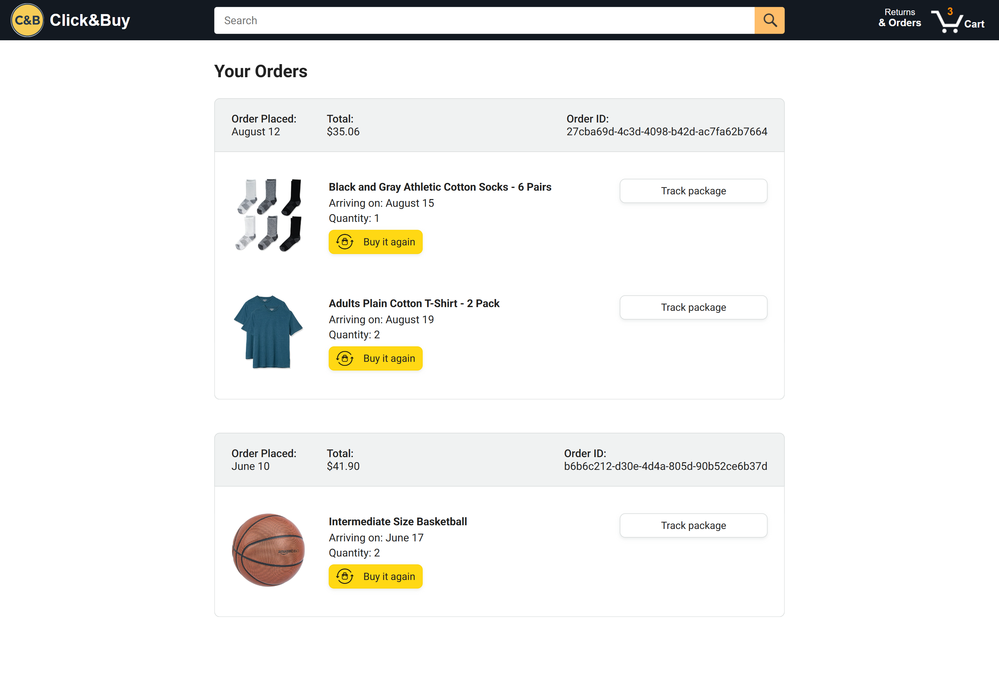
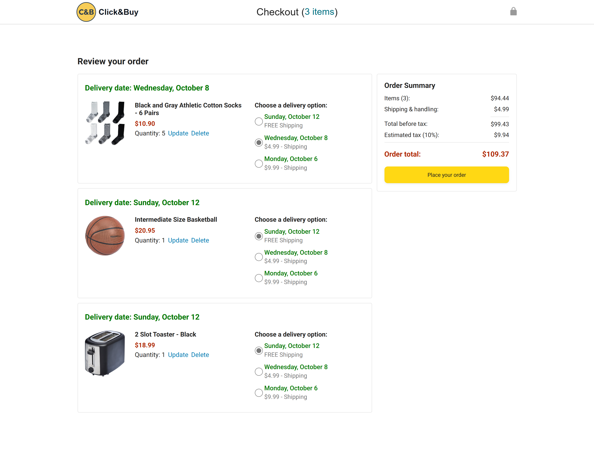

# 🛒 Click&Buy E-commerce Platform

## 📖 Project Description
**Click-Buy** is a fully responsive **e-commerce website frontend** developed using **HTML, CSS, and JavaScript**.  
It provides an interactive shopping experience where users can explore products, view details, and manage their cart — all built with pure frontend technologies.  

The project emphasizes **clean UI design**, **dynamic DOM manipulation**, and **code reliability** through **Jasmine testing**. Click-Buy replicates a real-world online store interface with smooth interactivity and modern web design principles.

---

## 🖼️ Screenshots
### 🏠 Home Page  

### 🛍️ Orders Page  

### 🛍️ Checkout Page  

### 🛒 Tracking Page  

---

## 🧰 Tools & Technologies Used
- **HTML5** – Website structure  
- **CSS3** – Styling and responsive layout  
- **JavaScript (ES6+)** – Logic and interactivity  
- **Jasmine Testing Framework** – Unit testing for reliability  
- **Git & GitHub** – Version control and deployment  
- **VS Code** – Code editor for development  

---

## 💡 What I Have Learned
During the development of **Click-Buy**, I learned to:
- Build a complete and responsive frontend from scratch  
- Implement **DOM manipulation** for dynamic content updates  
- Apply **Object-Oriented Programming** in JavaScript  
- Use **modules** and handle **asynchronous operations** (Promises, fetch, async/await)  
- Write and execute **Jasmine test cases** for quality assurance  
- Manage code efficiently using **Git**  
- Combine creativity with logic for an intuitive e-commerce UI  

---

## 🏁 Conclusion
Developing **Click-Buy** enhanced my frontend development skills and gave me practical exposure to creating a real-world e-commerce interface.  
It helped me understand how design, interactivity, and testing come together to deliver a seamless online shopping experience.

---

## 🙌 Author
**Harika Reddi**  
📍 CSE Student | Web Developer | Tech Enthusiast 
